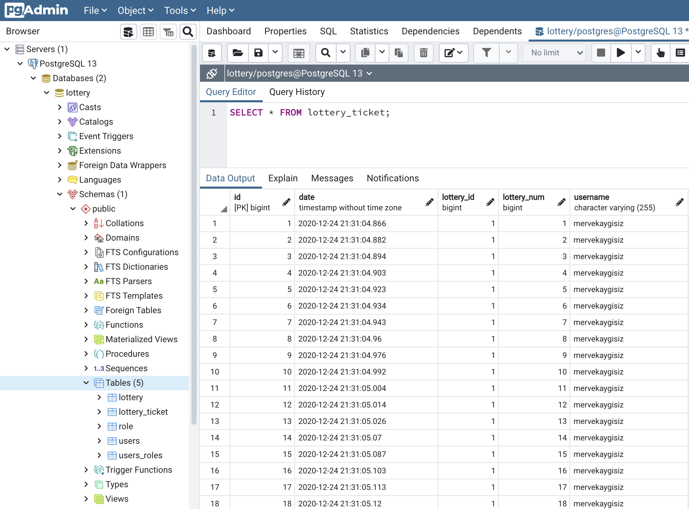

# Lottery System

The system should have a way to create Lotteries. Users can participate in any lottery that isn't finished yet. 
When you participate to a Lottery you become part of its extraction pool of potential winners. 
Once the Lottery closes a random winner is extracted from the pool and save winner number in a storage.

Logic is:
- The service will allow anyone to register as a lottery participant.
- Lottery participants will be able to submit as many lottery ballots for any lottery that isn’t yet finished.
- Each day at midnight the lottery event will be considered closed and a random lottery winner will be selected from all participants for the day.
- All users will be able to check the winning ballot for any specific date.
- The service will have to persist the data regarding the lottery.

## 1 - How to Run Project

-  ### Running with Docker Compose

Simply use: 

 ```sh
$ docker-compose up
$ docker-compose down
 ```
 -  ### Running on your local
 
 #### Prerequisites
 
 - Java 11
 - Postgresql
 - Your preferred IDE
      - Eclipse 
      - IntelliJ IDEA
      - VS Code
 
 Create your database named **lottery** in postgresql and change **application.properties** as :

```sh
spring.datasource.url=jdbc:postgresql://localhost:5432/lottery
spring.datasource.username=postgres
spring.datasource.password=password

## Hibernate Properties
# The SQL dialect makes Hibernate generate better SQL for the chosen database
spring.jpa.properties.hibernate.dialect = org.hibernate.dialect.PostgreSQLDialect

# Hibernate ddl auto (create, create-drop, validate, update)
spring.jpa.hibernate.ddl-auto = create
spring.jpa.generate-ddl=true
spring.jpa.show-sql=true

spring.mvc.view.prefix: /
spring.mvc.view.suffix: .jsp
spring.messages.basename=validation
 ```
 Then run that command in terminal:
 
  ```sh
 $ mvn clean spring-boot:run
 ```

## 2 - Tools and Technologies Used

* ```Spring Boot```- 2.0.4.RELEASE
* ```JDK``` - 1.8 or later
* ```Spring Framework``` - 5.0.8 RELEASE
* ```Hibernate``` - 5.2.17.Final
* ```Spring Data``` JPA
* ```Maven``` - 3.2+
* ```IDE``` - Eclipse or Spring Tool Suite (STS)
* ```PostgreSQL``` - 42.2.5
* ```JSP```
* ```Spring Security```
* ```Spring Web```
* ```Postman```
* ```SonarLint```


## 3 - Packaging Structure
Following is the packing structure of our Lottery System:


## 4 - Database Design

Since I am planning on querying the database with different queries and I need to join between storages I prefered using a standard SQL database and not a noSql approach. NoSQL databases really shine if the data to store is not so well defined. However, I have a clear pattern of data to store. 

I have 4 tables for the lottery design. One called lottery which holds the lottery information for the current lottery and one called lottery_ticket holding the ticket information for the lotteries. Users table holds user details and role table defines user role. Here is how I design:

**lottery**

- id 
- name
- start_date
- end_date
- winnerLotteryNumber


**lottery_ticket**
- id 
- lottery_id
- username
- lotteryNumber (The number of the ticket in the current lottery. It contains sequential numbers for per lottery.)
- date

**users**

- id
- username
- first_name
- last_name
- password
- role

**role**
- id
- name


The PostgreSQL database looks like:





## 5 - Exception(Error) Handling for RESTful Services

Spring Boot provides a good default implementation for exception handling for RESTful Services. **@ControllerAdvice** is a specialization of the @Component annotation which allows to handle exceptions across the whole application in one global handling component.


- ### Resource Not Present
Here's what happens when you fire a request to a resource not found:

http://localhost:8080/lottery/endLotteryAndSelectRandomLotteryWinner/5  

 ```sh
{  
    "timestamp": "2020-12-23T16:44:39.079+00:00",  
    "message": "Lottery not found for this id :: 5",  
    "details": "uri=/lottery/endLotteryAndSelectRandomLotteryWinner/5"  
}  
 ```

- ### Get Active Lottery Result 
http://localhost:8080/lotteryResult/5  

 ```sh
{  
    "timestamp": "2020-12-23T17:16:46.879+00:00",  
    "message": "Lottery is not finish yet :: 5",  
    "details": "uri=/lotteryResult/5"  
}  
 ```
 
- ### Invalid User Registration  
  
http://localhost:8080/register  


 ```sh
{  
    "timestamp": "2020-12-23T14:13:02.501+00:00",  
    "message": "user already exist :: mervekay",  
    "details": "uri=/register"  
}  
 ``` 
 

## 6 - Testing REST APIs via Postman Client

You can find all api queries in the attachted postman collection [here](lottery-system.postman_collection.json).

* ### User registration


* ### Throws exception if user trys to register with same username


* ### Get all active lotteries


* ### Submit lottery ticket


* ### Throws exception if user trys to submit ticket with unregistered username


* ### Throws exception if user trys to submit ticket for passive lottery


* ### End lottery by lottery id


* ### Throws exception if lottery does not exist


## 7 - Coulda/Woulda/Shoulda

- [ ] I would have implemented integration tests.
- [ ] I could have loaded data from the xml file using the [dbunit](https://springtestdbunit.github.io/spring-test-dbunit/index.html) library while writing unit tests. 
- [ ] I would have completed front-end part.
- [ ] I could have extended queries usign DateUtils.
- [ ] I could have implemented submit ticket endpoint without username parameter, I could have get active user automatically.
- [x] I would have dockerized the project.
